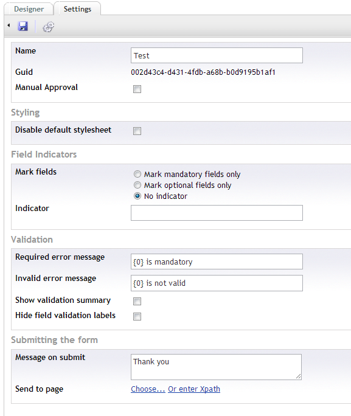
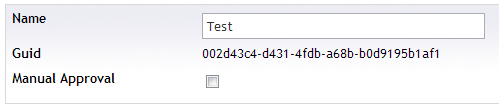
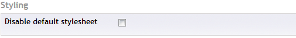
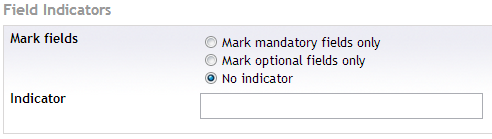
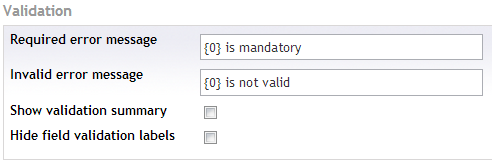
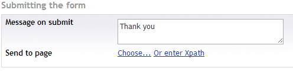
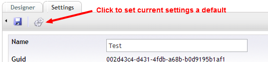

#Form settings
Besides the form design you can also setup some settings to customize how your form will behave.

The full settings tab looks like this

##General

###Name
The name of your form, this name will appear in the forms tree of the Contour section and also in the form picker datatype and form macro.
###Guid
The id of the form, this is a readonly value that might be usefull to the developers
###Manual Approval
The option to set a form to manual approval, by default a form record will be placed in the approved state after it has been submitted. If you wish to leave it in the submitted state and manually place it in the approves state then check this option (might be usefull if there are workflows that happen on approval).

##Styling

###Disable default stylesheet
More site design orientated (so probably for the developer) but enabling this option will prevent a default stylesheet being added to the pages where the Contour form is placed.

##Field indicators

###Mark fields
###Indicator

##Validation

###Required error message
###Invalid error message
###Show validation summary
###Hide field validation labels

##Submitting the form
What happens when the form has been submitted, there are 2 options that can be setup.

###Message on submit
Display some text (staying on the same page)
###Send to page
Selecting a page where the user will be redirected after submitting the form

##Setting current settings as default

If you wish to store the current settings as default you can do so by hitting the associated button in the toolbar. Doing so will result in new forms having the same settings.

