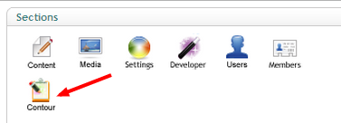
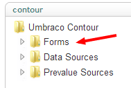
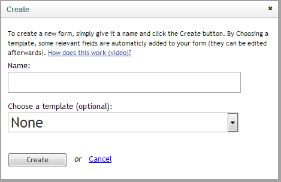
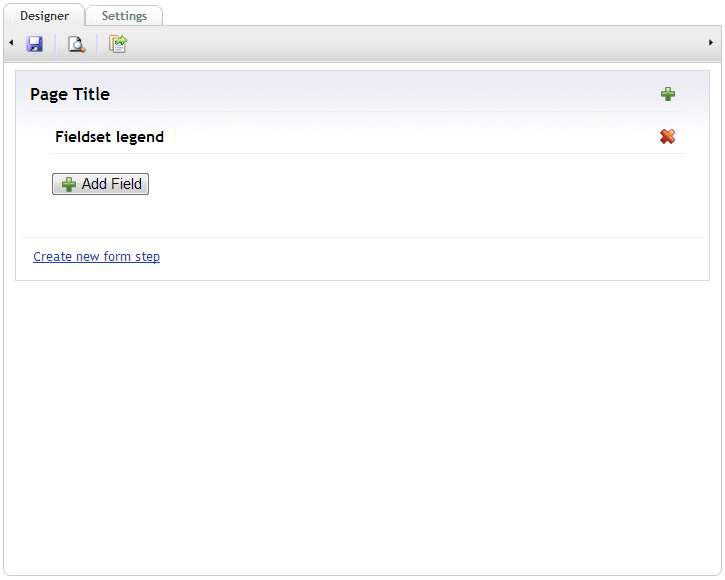
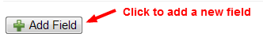
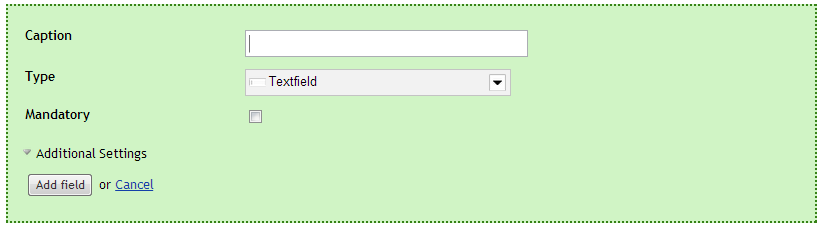
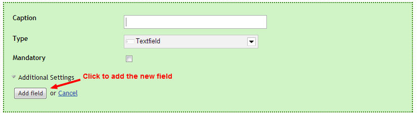
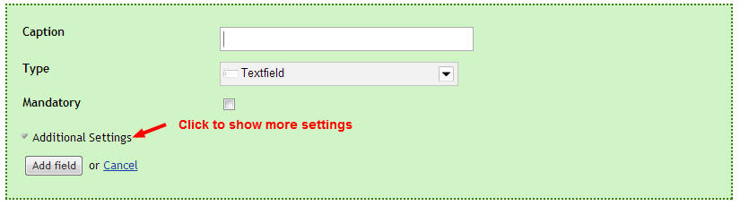
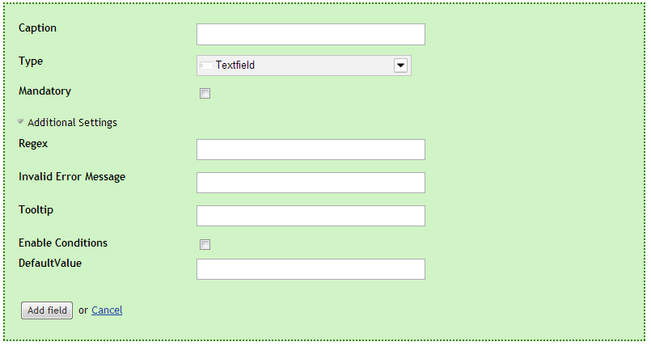

#Creating a form
##Navigate to the Contour section
Managing forms happens in the Contour section of the Umbraco backoffice so first navigate to this section by selecting it (you'll need to have Contour installed and have access to this section in order to see it).

##Right click the forms tree
Next similar to most create actions in the Umbraco backoffice you'll have to right click the forms tree/folder and select create

##Name the form
After selecting create you should see the following dialog

Where you'll need to supply a name for the form and have the option to start from a template (the template will already have some fields definied so you don't start from a completely empty form).

Hitting create will obviously create your new form.

##Design the form

The next screen you should see after hitting the create button is the form designer

There is already a page and a fieldset available the rest of the form has to be added using the UI(unless you started from a template then you alreayd get some fields).

##Setting the page title

The page title can be placed in edit mode by simply clicking it.

##Setting the fieldset legend

The same applies for the fieldset legend, clicking it will place it in edit mode.

##Adding fields

To add a new field hit the add field button in the fieldset where you wish to add the extra field.

That should display the following form

Where you'll need to supply a caption for the new field (will be used on the field) and choose the type. By default the type is set to textfield but other options are available.

- Checkbox
- Checkboxlist
- Datepicker
- Dropdownlist
- File upload
- Hidden field
- Password field
- Radiobuttonlist
- Recaptcha (from v3.0.7)
- Textarea
- Textfield

Caption and type are the only 2 mandatory fields you need to provide for adding a new field to your form. Once those are supplied the field can be added.

It's also possible to provide additional settings (these will be dependant on the chosen fieldtype, to show the extra settings hit the additional settings link.

The add field form should now expand with the additional settings

