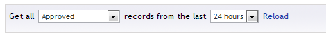
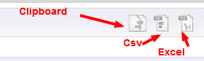

#Viewing and exporting entries

The entries viewer for each form can be found when expanding the form in the tree

##Overview

When accessing the entries viewer you should get a screen similar to

##Filtering

By default you'll see the approved record of the last 24 hours, if you want to change this simply update the filter settings

##Exporting visible selection

It's possible to export the entries that are currently visible

There are 3 options available 

- Clipboard
- Csv
- Excel

##Exporting complete record data

##Individual record actions

###Approve
###Delete
###Edit
###Email

##Bulk record actions

###Approve
###Delete

##Toggling visible fields

