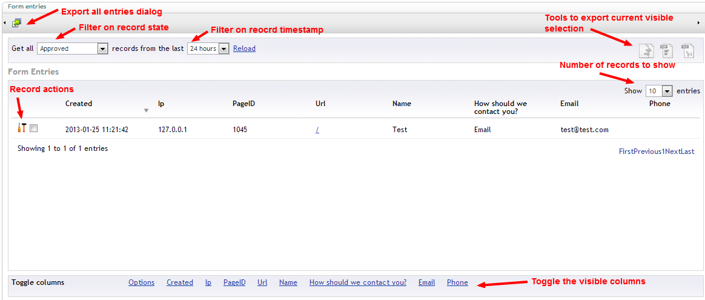

#Viewing and exporting entries

The entries viewer for each form can be found when expanding the form in the tree

##Overview

When accessing the entries viewer you should get a screen similar to

##Filtering

##Exporting visible selection

##Exporting complete record data

##Individual record actions

###Approve
###Delete
###Edit
###Email

##Bulk record actions

###Approve
###Delete

##Toggling visible fields

